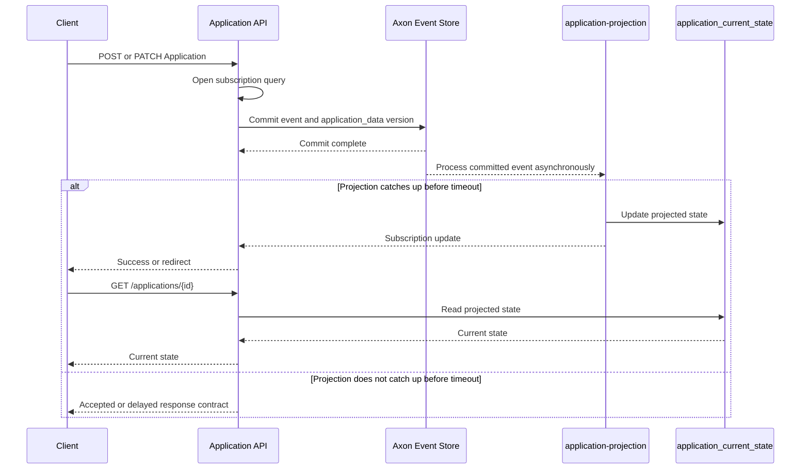
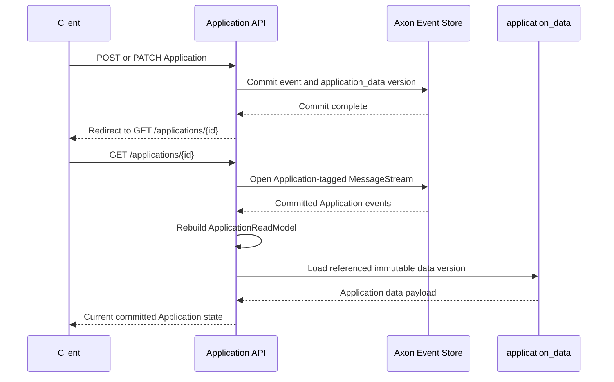

# ADR 0004: Use Native Axon Replay for Get Application

- Status: Proposed
- Date: 2026-08-14
- Author: David Stuart
- Scope: `data-access-service-axon`
- Proof of concept: `feat/DSTEW-2081-handle-single-application-queries`

## Context

`GET /api/v0/applications/{id}` currently reads `application_current_state`, which is maintained
asynchronously by the `application-projection` pooled streaming processor. A command can commit
its events and referenced immutable `application_data` version before this projection has processed
the event.

The current implementation compensates for this by opening subscription queries and blocking
command or controller threads until the projection is readable. This prevents stale Get Application
responses when the projection catches up within the configured timeout, but makes the write and
read paths depend on projection readiness.

If these blocking checks are removed while Get Application continues to read the projection, a
client that follows a Post-Get Redirect can receive stale state. This decision considers native
replay as the way to remove the blocking workaround while retaining asynchronous projection
processing. It applies only to Get Application by identifier. Application search, filtered list,
history, and other projection-backed queries remain eventually consistent.

Application streams are expected to contain fewer than 50 events. Snapshots are not planned for
this scope. The response does not currently expose an ETag or support `asOf` reads. This ADR does
not select a client-managed projection-consistency contract. Native replay must meet the agreed Get
Application p95 and p99 latency targets for representative 50-event streams under expected
concurrent load.

## Decision drivers

- A Post-Get Redirect must return the state produced by the committed Application command.
- Get Application must not depend on the asynchronous projection having caught up.
- The Application projection must retain Axon's normal asynchronous processing without command or
  controller threads blocking solely to make Get Application current.
- The implementation must use Axon Framework 5 APIs and avoid coupling to Axon event-store tables
  and persisted payload formats.
- Per-request replay work must remain acceptable for Application streams of fewer than 50 events.
- Changes to Application events must have a clear and testable effect on the Get Application path.
- The existing projections must remain available for search, list, history, and other query cases.

## Considered options

1. Continue to serve Get Application from the asynchronous projection.
2. Rebuild the Application read model through raw JDBC access to Axon event-store tables.
3. Rebuild the Application read model through Axon 5 native tag-filtered `MessageStream` access.
4. Keep projection-backed Get Application and use an ETag plus `asOf` projection-position contract.

## Decision matrix

| Criterion | Projection with readiness wait | Raw JDBC replay | Native Axon replay | Projection with ETag and `asOf` |
|---|---|---|---|---|
| Read-your-writes after Post-Get Redirect | Yes, while readiness wait succeeds | Yes | Yes | Yes, after client retry |
| Requires blocking projection-readiness workaround | Yes | No | No | No |
| Requires client retry or polling | No | No | No | Yes |
| Returns stale state if the workaround is removed | Yes | No | No | No, when client follows the contract |
| Independent of projection lag | No | Yes | Yes | No |
| Coupled to Axon persistence schema and serialized payloads | No | Yes | No | No |
| Uses supported Axon 5 event-store API | Not applicable | No | Yes | Not applicable |
| Suitable for fewer than 50 events per Application | Yes | Yes | Yes | Yes |
| Reuses Axon's message type and event-stream handling | No | No | Yes | No |
| Maintains a separate replay dispatch path | No | Yes | Yes | No |
| Suitable for search and filtered list queries | Yes | No | No | Yes |

## Decision

Use Axon 5 native tag-filtered `MessageStream` access to rebuild `ApplicationReadModel` for the
canonical `GET /api/v0/applications/{id}` endpoint.

The replay reads Application-tagged committed events from Axon's `EventStore`, applies the known
current-state event transitions, and hydrates the immutable `application_data` payload identified
by the resulting `applicationDataVersion`. It does not wait for or read the running projection.

Replace the existing projection-backed lookup for Get Application. Remove the raw JDBC replay path,
including `ApplicationRawReplayService`, `RawEventReplayer`, its query, diagnostic endpoint, and
tests once native replay has the replacement coverage. Do not add a fallback to the projection.

Native replay removes the projection-readiness waits used only to make Get Application current after
a command. Once the canonical identifier lookup replays committed Application events, command
handlers and controllers do not wait for `application-projection` before returning a successful
write response.

The `application-projection` remains a pooled streaming processor and continues with Axon's normal
asynchronous behaviour. Search, filtered list, history, and other projection-backed reads remain
eventually consistent. Any write endpoint that returns projection-derived data in its own response
requires a separate response-contract decision.

The POC for this decision is on branch
`feat/DSTEW-2081-handle-single-application-queries`.

## Relationship to CQRS

This decision retains command-query separation: Get Application does not load an aggregate to make
a command decision and does not mutate domain state.

It departs from the module's usual CQRS query pattern. Most query endpoints read an asynchronously
maintained projection that is optimised for query throughput, filtering, and search. Get Application
instead reconstructs one Application's current state from its committed event stream at request
time.

This is a deliberate exception for the Post-Get Redirect use case. It trades the normal projection
read performance and eventual-consistency model for a current response after a committed write. The
exception is limited to identifier lookup; search, filtered lists, history, and other queries
continue to use projections.

## Sequences

### Existing projection-backed Get Application with readiness wait

### Native replay Get Application

## Consequences

### Positive

- A Post-Get Redirect returns the committed Application state without waiting for
  `application-projection`.
- Get Application remains available when the Application projection is delayed, failed, or being
  rebuilt.
- The read path uses Axon Framework 5.2.0 APIs and tag filtering rather than querying
  `axon.domain_event_entry` directly.
- Replay work is bounded by the expected Application lifecycle of fewer than 50 events.
- The detailed response continues to use immutable, versioned `application_data` payloads.
- Removing raw JDBC replay eliminates dependence on Axon table layout and payload serialization.

### Negative

- Each Get Application request synchronously depends on the event store and `application_data`.
- Event-store read load and replay duration increase with Get Application traffic.
- A new Application event that affects current state must update the replay dispatch and tests.
- The replay and projection implementations can diverge unless contract coverage is maintained.
- The projection is still required for search, filtered lists, history, and other eventual-consistency
  query cases.

## Alternatives considered

### Continue using the asynchronous projection with readiness waits

Rejected because it provides read-your-writes only by blocking command or controller threads until
the asynchronous projection becomes readable. If the readiness waits are removed to retain Axon's
normal asynchronous processing, a Post-Get Redirect can read stale projection state.

It remains the appropriate implementation for search and filtered list queries, where eventual
consistency is accepted and indexed query performance is required.

### Use raw JDBC replay

Rejected because it couples Get Application to the `axon.domain_event_entry` schema, payload column
representation, ordering, and serializer configuration. It also bypasses Axon's event-store API.

### Use an ETag and `asOf` projection-position contract

Not selected because it keeps Get Application projection-backed but moves the consistency wait to
API clients. A successful command would return an ETag containing the committed event-store
position. The client would then request Get Application with that value as an `asOf` condition.

The API would return the Application only when the projection position has reached or passed the
requested position. Otherwise it would return `202 Accepted` with retry guidance, requiring the
client to poll or retry until the projection catches up.

This is not a transparent server-side change. Clients that use the Post-Get Redirect flow must
change their existing implementation to retain the version token returned by the write, send it
with Get Application, and handle `202 Accepted`, retry timing, timeouts, and retry limits.

This preserves Axon's normal asynchronous projection processing and avoids replaying events for
each Get Application request. However, it requires a public version-token contract,
projection-position persistence and comparison, careful cache control, and client changes. The
current API does not expose ETags or support `asOf` reads, so this option is outside the scope of
this decision.

### Use native Axon replay

Selected because it returns state from the committed Application event stream without projection
lag while retaining Axon's event-store abstraction. The expected stream size makes per-request
replay acceptable for this use case.

## Confirmation

Before this ADR is accepted, the implementation must demonstrate:

- an integration test where Get Application immediately follows a successful state-changing
  command and includes that command's state without waiting for the projection;
- removal of the subscription-query projection-readiness waits whose sole purpose is to make Get
  Application current after a command;
- contract tests comparing native replay and projection results after both have processed the same
  Application event stream;
- coverage for every current-state Application event in the canonical Get Application route;
- removal of raw JDBC replay production code, diagnostic route, and associated tests;
- benchmark results for 1, 20, 50, and the representative maximum Application event count, using
  production-equivalent event payloads and expected concurrent Get Application requests;
- monitoring of native replay duration, replay failures, and event-store connection-pool use after
  deployment.

Revisit this decision if Application streams approach 50 events, replay latency exceeds the agreed
service target, Get Application traffic materially increases, snapshots become necessary, or the
API needs ETags or historical `asOf` reads.

## Related documentation

- [ADR 0002: Separate sensitive application data from events](0002-separate-sensitive-data-from-domain-events.md)
- [Projections and replay](../projections-and-replay.md)
- [Axon in this module](../axon-in-this-module.md)